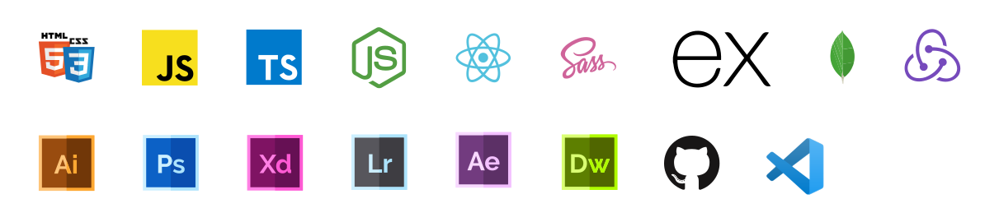

[](https://seelay.in)

** Hey there Stranger!**

I'm [Aman Seelay](https://seelay.in) a 21 y.o. Creative Designer , Full Stack Web Developer and a part time Digital Artist based in Chandighar , India.

**💻 My Skills & Tools I use**

[](https://seelay.in)

<details>
  <summary>Stats</summary>

---

<!--START_SECTION:waka-->


**🐱 My Github Data** 

> 🏆 0 Contributions in the Year 2021
 > 
> 📦 601.5 kB Used in Github's Storage 
 > 
> 🚫 Not Opted to Hire
 > 
> 📜 1 Public Repository 
 > 
> 🔑 91 Private Repositories  
 > 
**I'm a Night 🦉** 

```text
🌞 Morning    257 commits    ██████░░░░░░░░░░░░░░░░░░░   25.22% 
🌆 Daytime    194 commits    ████░░░░░░░░░░░░░░░░░░░░░   19.04% 
🌃 Evening    273 commits    ██████░░░░░░░░░░░░░░░░░░░   26.79% 
🌙 Night      295 commits    ███████░░░░░░░░░░░░░░░░░░   28.95%

```
📅 **I'm Most Productive on Thursday** 

```text
Monday       172 commits    ████░░░░░░░░░░░░░░░░░░░░░   16.88% 
Tuesday      131 commits    ███░░░░░░░░░░░░░░░░░░░░░░   12.86% 
Wednesday    87 commits     ██░░░░░░░░░░░░░░░░░░░░░░░   8.54% 
Thursday     209 commits    █████░░░░░░░░░░░░░░░░░░░░   20.51% 
Friday       165 commits    ████░░░░░░░░░░░░░░░░░░░░░   16.19% 
Saturday     126 commits    ███░░░░░░░░░░░░░░░░░░░░░░   12.37% 
Sunday       129 commits    ███░░░░░░░░░░░░░░░░░░░░░░   12.66%

```


📊 **This Week I Spent My Time On** 

```text
⌚︎ Time Zone: Asia/Kolkata

💬 Programming Languages: 
JavaScript               1 hr 57 mins        ████████████░░░░░░░░░░░░░   47.97% 
Markdown                 1 hr 15 mins        ███████░░░░░░░░░░░░░░░░░░   30.95% 
JSON                     51 mins             █████░░░░░░░░░░░░░░░░░░░░   20.87% 
CSS                      0 secs              ░░░░░░░░░░░░░░░░░░░░░░░░░   0.19% 
HTML                     0 secs              ░░░░░░░░░░░░░░░░░░░░░░░░░   0.01%

🔥 Editors: 
VS Code                  4 hrs 5 mins        █████████████████████████   100.0%

🐱‍💻 Projects: 
seelay-portfolio         4 hrs 5 mins        █████████████████████████   100.0%

💻 Operating System: 
Windows                  4 hrs 5 mins        █████████████████████████   100.0%

```

**I Mostly Code in JavaScript** 

```text
JavaScript               60 repos            ████████████████░░░░░░░░░   65.93% 
TypeScript               18 repos            █████░░░░░░░░░░░░░░░░░░░░   19.78% 
HTML                     5 repos             █░░░░░░░░░░░░░░░░░░░░░░░░   5.49% 
Vue                      4 repos             █░░░░░░░░░░░░░░░░░░░░░░░░   4.4% 
CSS                      3 repos             ░░░░░░░░░░░░░░░░░░░░░░░░░   3.3%

```


**Timeline**

 


 Last Updated on 14/07/2021
<!--END_SECTION:waka-->

---

 </details>

**🎵 I'm Listening to**

<object data="https://now-play.vercel.app/api/generate?uid=7a17a86e-d6b7-43b5-8d9c-1d6dae42a779" >

  

</object>

If you like what I do, maybe consider buying me a coffee/tea 🥺👉👈

<a href="https://www.buymeacoffee.com/seelay" target="_blank"></a>
