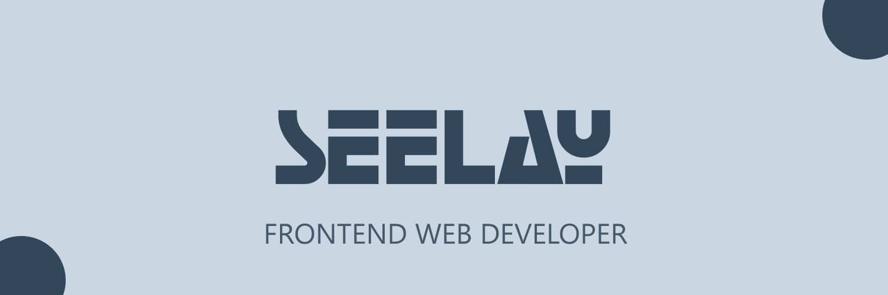

[](https://seelay.in)

##### Hi I'm Seelay! 👋

##### SKILLS & TOOLS 💻

[](https://seelay.in)

<details>
  <summary>STATS</summary>

---


##### Weekly development breakdown 📊

<!--START_SECTION:waka-->

```text
Week: 09 January, 2021 - 16 January, 2021

Other        8 hrs 56 mins   ███████████████████████░░   91.44 %
JavaScript   16 mins         ▓░░░░░░░░░░░░░░░░░░░░░░░░   02.74 %
Markdown     11 mins         ▒░░░░░░░░░░░░░░░░░░░░░░░░   01.98 %
JSON         10 mins         ▒░░░░░░░░░░░░░░░░░░░░░░░░   01.73 %
TypeScript   4 mins          ▒░░░░░░░░░░░░░░░░░░░░░░░░   00.69 %
```

<!--END_SECTION:waka-->

---

 </details>

##### I'm Listening 🎵

<object data="https://now-play.vercel.app/api/generate?uid=7a17a86e-d6b7-43b5-8d9c-1d6dae42a779" >

  

</object>
