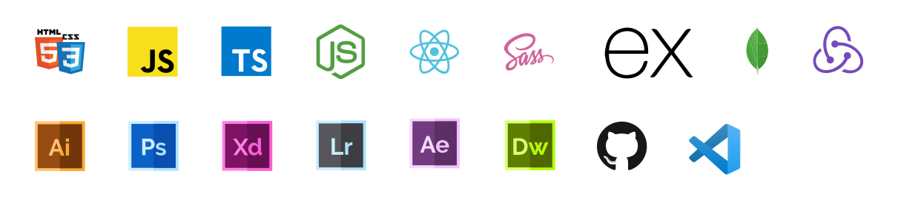

[](https://www.seelay.in)

**Hey 👋**

I'm Aman Seelay, a versatile and forward-thinking product designer from India, combining [creative](https://illustrations.seelay.in) flair with [technical](https://www.seelay.in/#skills) expertise to craft engaging and effective [digital experiences](https://www.seelay.in/#work). I’m passionate about continuous learning and building [solutions](https://www.seelay.in/#projects) that improve people's lives.

**💻 My Skills & Tools I use**

[](https://www.seelay.in/about)

<details>
  <summary>Stats</summary>

---

<!--START_SECTION:waka-->


**🐱 My GitHub Data** 

> 📦 830.0 kB Used in GitHub's Storage 
 > 
> 🏆 194 Contributions in the Year 2026
 > 
> 💼 Opted to Hire
 > 
> 📜 1 Public Repository 
 > 
> 🔑 28 Private Repository 
 > 
**I'm a Night 🦉** 

```text
🌞 Morning                650 commits         ███░░░░░░░░░░░░░░░░░░░░░░   12.32 % 
🌆 Daytime                601 commits         ███░░░░░░░░░░░░░░░░░░░░░░   11.40 % 
🌃 Evening                1730 commits        ████████░░░░░░░░░░░░░░░░░   32.80 % 
🌙 Night                  2293 commits        ███████████░░░░░░░░░░░░░░   43.48 % 
```
📅 **I'm Most Productive on Sunday** 

```text
Monday                   658 commits         ███░░░░░░░░░░░░░░░░░░░░░░   12.48 % 
Tuesday                  774 commits         ████░░░░░░░░░░░░░░░░░░░░░   14.68 % 
Wednesday                700 commits         ███░░░░░░░░░░░░░░░░░░░░░░   13.27 % 
Thursday                 737 commits         ███░░░░░░░░░░░░░░░░░░░░░░   13.97 % 
Friday                   588 commits         ███░░░░░░░░░░░░░░░░░░░░░░   11.15 % 
Saturday                 852 commits         ████░░░░░░░░░░░░░░░░░░░░░   16.15 % 
Sunday                   965 commits         █████░░░░░░░░░░░░░░░░░░░░   18.30 % 
```


📊 **This Week I Spent My Time On** 

```text
🕑︎ Time Zone: Asia/Kolkata

💬 Programming Languages: 
Other                    6 hrs 20 mins       ████████████████████████░   94.08 % 
JSON                     21 mins             █░░░░░░░░░░░░░░░░░░░░░░░░   05.34 % 
TypeScript               2 mins              ░░░░░░░░░░░░░░░░░░░░░░░░░   00.58 % 

🔥 Editors: 
Chrome                   6 hrs 32 mins       ████████████████████████░   96.95 % 
Cursor                   9 mins              █░░░░░░░░░░░░░░░░░░░░░░░░   02.45 % 
Edge                     2 mins              ░░░░░░░░░░░░░░░░░░░░░░░░░   00.60 % 

💻 Operating System: 
Windows                  6 hrs 44 mins       █████████████████████████   100.00 % 
```

**I Mostly Code in JavaScript** 

```text
JavaScript               17 repos            ██████████████░░░░░░░░░░░   56.67 % 
TypeScript               6 repos             █████░░░░░░░░░░░░░░░░░░░░   20.00 % 
HTML                     4 repos             ███░░░░░░░░░░░░░░░░░░░░░░   13.33 % 
Java                     2 repos             ██░░░░░░░░░░░░░░░░░░░░░░░   06.67 % 
Astro                    1 repo              █░░░░░░░░░░░░░░░░░░░░░░░░   03.33 % 
```


 Last Updated on 25/03/2026 07:40:11 UTC
<!--END_SECTION:waka-->

---

 </details>

**🎵 I'm Listening to**

<object data="https://now-play.vercel.app/api/generate?uid=7a17a86e-d6b7-43b5-8d9c-1d6dae42a779" >

  

</object>

If you like what I do, maybe consider buying me a coffee/tea 🥺👉👈

<a href="https://www.buymeacoffee.com/seelay" target="_blank"></a>
