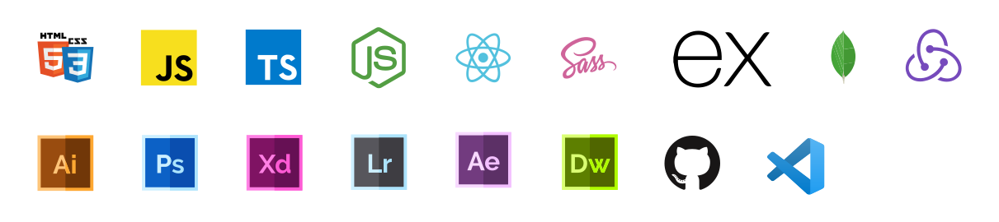

[](https://www.seelay.in)

**Hey 👋**

I'm Aman Seelay, a versatile and forward-thinking product designer from India, combining [creative](https://illustrations.seelay.in) flair with [technical](https://www.seelay.in/#skills) expertise to craft engaging and effective [digital experiences](https://www.seelay.in/#work). I’m passionate about continuous learning and building [solutions](https://www.seelay.in/#projects) that improve people's lives.

**💻 My Skills & Tools I use**

[](https://www.seelay.in/about)

<details>
  <summary>Stats</summary>

---

<!--START_SECTION:waka-->


**🐱 My GitHub Data** 

> 📦 900.2 kB Used in GitHub's Storage 
 > 
> 🏆 593 Contributions in the Year 2026
 > 
> 💼 Opted to Hire
 > 
> 📜 1 Public Repository 
 > 
> 🔑 28 Private Repository 
 > 
**I'm a Night 🦉** 

```text
🌞 Morning                701 commits         ███░░░░░░░░░░░░░░░░░░░░░░   12.27 % 
🌆 Daytime                627 commits         ███░░░░░░░░░░░░░░░░░░░░░░   10.97 % 
🌃 Evening                1888 commits        ████████░░░░░░░░░░░░░░░░░   33.04 % 
🌙 Night                  2498 commits        ███████████░░░░░░░░░░░░░░   43.72 % 
```
📅 **I'm Most Productive on Sunday** 

```text
Monday                   712 commits         ███░░░░░░░░░░░░░░░░░░░░░░   12.46 % 
Tuesday                  818 commits         ████░░░░░░░░░░░░░░░░░░░░░   14.32 % 
Wednesday                790 commits         ███░░░░░░░░░░░░░░░░░░░░░░   13.83 % 
Thursday                 827 commits         ████░░░░░░░░░░░░░░░░░░░░░   14.47 % 
Friday                   630 commits         ███░░░░░░░░░░░░░░░░░░░░░░   11.03 % 
Saturday                 929 commits         ████░░░░░░░░░░░░░░░░░░░░░   16.26 % 
Sunday                   1008 commits        ████░░░░░░░░░░░░░░░░░░░░░   17.64 % 
```


📊 **This Week I Spent My Time On** 

```text
🕑︎ Time Zone: Asia/Kolkata

💬 Programming Languages: 
Other                    1 hr 34 mins        ███████████████████████░░   91.41 % 
TypeScript               8 mins              ██░░░░░░░░░░░░░░░░░░░░░░░   08.59 % 
Astro                    0 secs              ░░░░░░░░░░░░░░░░░░░░░░░░░   00.00 % 

🔥 Editors: 
Chrome                   1 hr 33 mins        ███████████████████████░░   90.54 % 
Cursor                   9 mins              ██░░░░░░░░░░░░░░░░░░░░░░░   09.46 % 

💻 Operating System: 
Windows                  1 hr 43 mins        █████████████████████████   100.00 % 
```

🤖 **AI Coding This Week** 

```text
⏱ AI Coding Time: 8 mins (8.59%)

✍️ 30 lines written by AI, 0 lines written by hand (100.0% AI-written)

🔤 0 Input Tokens, 0 Output Tokens

💵 $0.00 Estimated AI Cost This Week

🧠 2 AI Sessions, 4 AI Prompts

Composer                 47 lines            █████████████████████████   100.00 % 

🔎 AI Coding Insights:
🤖 AI-Driven — 100.0% of written lines came from AI
📝 Concise Prompter — average 298 characters per prompt
🔁 Iterative Prompter — average 2 prompts per session
🚀 High AI Trust — 0.0% of changed lines were hand-edited
```

**I Mostly Code in JavaScript** 

```text
JavaScript               18 repos            ███████████████░░░░░░░░░░   58.06 % 
TypeScript               6 repos             █████░░░░░░░░░░░░░░░░░░░░   19.35 % 
HTML                     4 repos             ███░░░░░░░░░░░░░░░░░░░░░░   12.90 % 
Java                     2 repos             ██░░░░░░░░░░░░░░░░░░░░░░░   06.45 % 
Astro                    1 repo              █░░░░░░░░░░░░░░░░░░░░░░░░   03.23 % 
```


 Last Updated on 09/08/2026 07:34:36 UTC
<!--END_SECTION:waka-->

---

 </details>

**🎵 I'm Listening to**

<object data="https://now-play.vercel.app/api/generate?uid=7a17a86e-d6b7-43b5-8d9c-1d6dae42a779" >

  

</object>

If you like what I do, maybe consider buying me a coffee/tea 🥺👉👈

<a href="https://www.buymeacoffee.com/seelay" target="_blank"></a>
