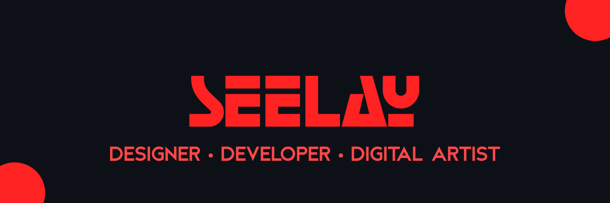

[](https://seelay.in)

## Hello! 👋

## SKILLS & TOOLS

<code></code>
<code></code>
<code></code>
<code></code>
<code></code>
<code></code>
<code></code>
<code></code>
<code></code>
<code></code>
<code></code>
<code></code>
<code></code>
<code></code>
<code></code>
<code></code>
<code></code>
<code></code>

<details>
  <summary>STATS</summary>


<!--START_SECTION:waka-->

```text
Other        9 hrs 5 mins    ████████░░░░░░░░░░░░░░░░░   31.36 %
JavaScript   9 hrs 5 mins    ███████▓░░░░░░░░░░░░░░░░░   31.33 %
EJS          2 hrs 22 mins   ██░░░░░░░░░░░░░░░░░░░░░░░   08.17 %
CSS          2 hrs 9 mins    ██░░░░░░░░░░░░░░░░░░░░░░░   07.43 %
Vue.js       1 hr 7 mins     █░░░░░░░░░░░░░░░░░░░░░░░░   03.87 %
```

<!--END_SECTION:waka-->

 </details>

## I'm Listening 🎵

<object data="https://now-play.vercel.app/api/generate?uid=7a17a86e-d6b7-43b5-8d9c-1d6dae42a779" >

  

</object>
